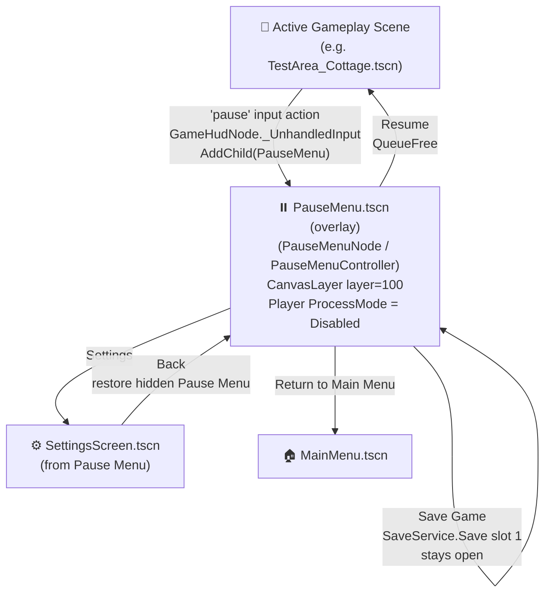
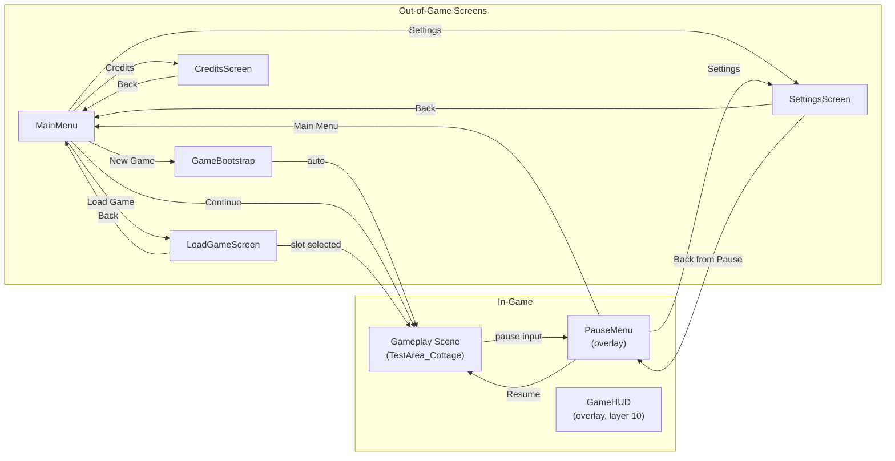

# Menu Flow Diagram — EchoForest

**Document Version:** 1.2
**Last Updated:** July 27, 2026
**Source:** `ui-ux-spec.md` §3 (Main Menu) + §9 (Pause Menu)  
**Implementation reference:** `MainMenuConfig.cs` scene path constants

---

## Legend

| Symbol      | Meaning                                                  |
| ----------- | -------------------------------------------------------- |
| `[Screen]`  | Full scene swap (`ISceneLoader.LoadScene`)               |
| `[Overlay]` | `CanvasLayer` added on top of current scene (`AddChild`) |
| `[OS]`      | Application exits                                        |
| ✅          | Implemented                                              |
| 🔲          | Planned (not yet implemented)                            |

---

## 1. Main Menu Flow


**Scene path constants** (`MainMenuConfig.cs`):

| Transition | Constant                 | Path                                     |
| ---------- | ------------------------ | ---------------------------------------- |
| Main Menu  | `SceneResPath`           | `res://src/Scenes/MainMenu.tscn`         |
| New Game   | `GameBootstrapScenePath` | `res://src/Scenes/GameBootstrap.tscn`    |
| Continue   | `ContinueScenePath`      | `res://src/Scenes/TestArea_Cottage.tscn` |
| Load Game  | `LoadGameScenePath`      | `res://src/Scenes/LoadGameScreen.tscn`   |
| Settings   | `SettingsScenePath`      | `res://src/Scenes/SettingsScreen.tscn`   |
| Credits    | `CreditsScenePath`       | `res://src/Scenes/CreditsScreen.tscn`    |

---

## 2. Pause Menu Flow



**Pause Menu scene path** (`MainMenuConfig.cs`):

| Constant             | Path                              |
| -------------------- | --------------------------------- |
| `PauseMenuScenePath` | `res://src/Scenes/PauseMenu.tscn` |

> **Settings opened from Pause Menu:** `PauseMenuNode` hides and disables its overlay, then adds `SettingsScreenNode` to `SceneTree.Root`. `SettingsScreenNode.OnBack()` restores the hidden pause overlay and frees only the Settings overlay. Settings opened from Main Menu remains a full-scene flow and returns to Main Menu.

---

## 3. Combined Overview



---

## 4. Controller ↔ Scene Mapping

| Screen                  | Controller class      | Node class           | Layer                      |
| ----------------------- | --------------------- | -------------------- | -------------------------- |
| `MainMenu.tscn`         | `MainMenuController`  | `MainMenuNode`       | CanvasLayer (default)      |
| `GameBootstrap.tscn`    | —                     | `GameBootstrapNode`  | Node2D                     |
| `LoadGameScreen.tscn`   | —                     | `LoadGameScreenNode` | CanvasLayer                |
| `SettingsScreen.tscn`   | `SettingsController`  | `SettingsScreenNode` | CanvasLayer                |
| `CreditsScreen.tscn`    | `CreditsController`   | `CreditsScreenNode`  | CanvasLayer                |
| `GameHUD.tscn`          | `GameHudController`   | `GameHudNode`        | CanvasLayer, `layer = 10`  |
| `PauseMenu.tscn`        | `PauseMenuController` | `PauseMenuNode`      | CanvasLayer, `layer = 100` |
| `TestArea_Cottage.tscn` | —                     | `CottageAreaNode`    | Node2D (root)              |

---

## 5. Transition Implementation Notes

- **Full scene swap:** `ISceneLoader.LoadScene(path)` → calls `GetTree().ChangeSceneToFile(path)`. Previous scene is destroyed.
- **Overlay (Pause Menu):** `GD.Load<PackedScene>(path).Instantiate<PauseMenuNode>()` is added via `GetTree().Root.AddChild(...)` in `CottageAreaNode._UnhandledInput`. The generic instantiation makes a missing C# script binding fail immediately instead of silently returning a base `CanvasLayer`. Gameplay stays in tree; only the `Player` node has its `ProcessMode` set to `Disabled` to freeze movement.
- **Why NOT `GetTree().Paused`:** In Godot 4, `SceneTree.Paused = true` blocks `_gui_input` on **all** nodes — including those with `ProcessMode.Always` — preventing button `Pressed` signals from firing. `CottageAreaNode` deliberately avoids this.
- **Overlay visual blocking:** The `Overlay` ColorRect must have `mouse_filter = IGNORE (2)` so mouse events pass through it to the buttons. Default `mouse_filter = STOP (0)` on a full-screen overlay can intercept clicks before they reach the button controls.
- **Button wiring pattern:** Dynamic menu overlays connect `Button.Pressed` in the root node's `_Ready()` with `FindChild(name)`. Do not rely on `.tscn` `[connection]` blocks for dynamically added C# overlays.
- **Back from overlay:** `QueueFree()` on the overlay node + `player.ProcessMode = ProcessModeEnum.Inherit` restored via `TreeExiting` signal.
- **Settings from Pause:** Hide and disable `PauseMenuNode`, add `SettingsScreenNode` to `SceneTree.Root`, then restore the pause overlay and `QueueFree()` the Settings overlay on Back. Do not replace the gameplay scene for this path.

### C# Script Binding and UID Validation

For a `.tscn` root backed by a C# node wrapper, declare `script` as a node property rather than in the `[node]` header:

```gdscene
[ext_resource type="Script" uid="uid://example" path="res://src/Scripts/Core/FooNode.cs" id="1_script"]

[node name="Foo" type="CanvasLayer"]
script = ExtResource("1_script")
```

Validate the `uid` against the generated sidecar file before committing: `src/Scripts/Core/FooNode.cs.uid` contains the authoritative `uid://...` value. The UID and `path` in the scene's `ext_resource` must refer to that same script. If `Instantiate<FooNode>()` throws an `InvalidCastException` to the base Godot type, check this binding first, then restart the game so Godot reloads the PackedScene.

---

## 6. Revision History

| Version | Date           | Changes                                                                                         |
| ------- | -------------- | ----------------------------------------------------------------------------------------------- |
| 1.0     | April 28, 2026 | Initial diagram — Main Menu + Pause Menu flows                                                  |
| 1.1     | April 28, 2026 | Fixed implementation notes: no `GetTree().Paused`, Overlay `mouse_filter`, FindChild            |
| 1.2     | July 27, 2026  | Fixed Pause → Settings → Back flow; documented dynamic menu wiring and C# script UID validation |
